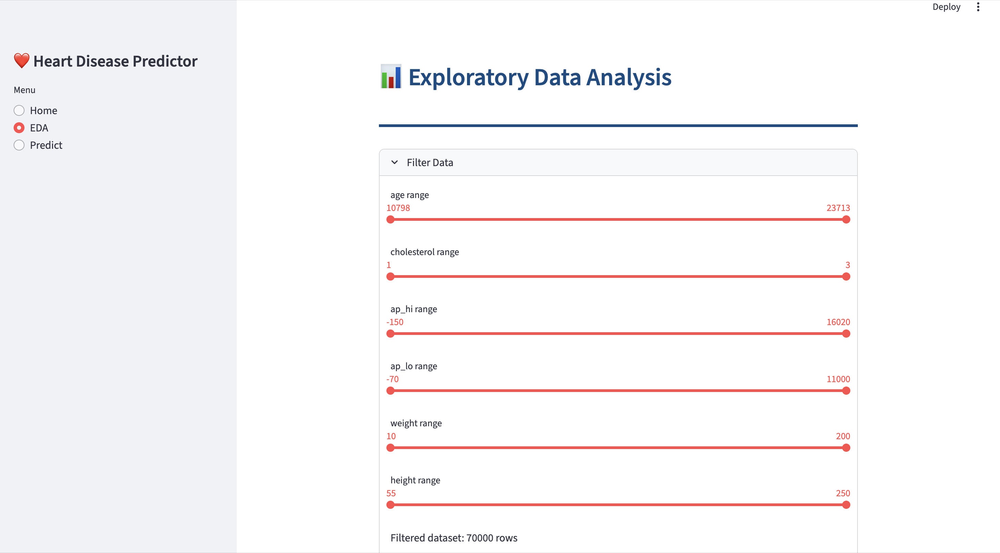
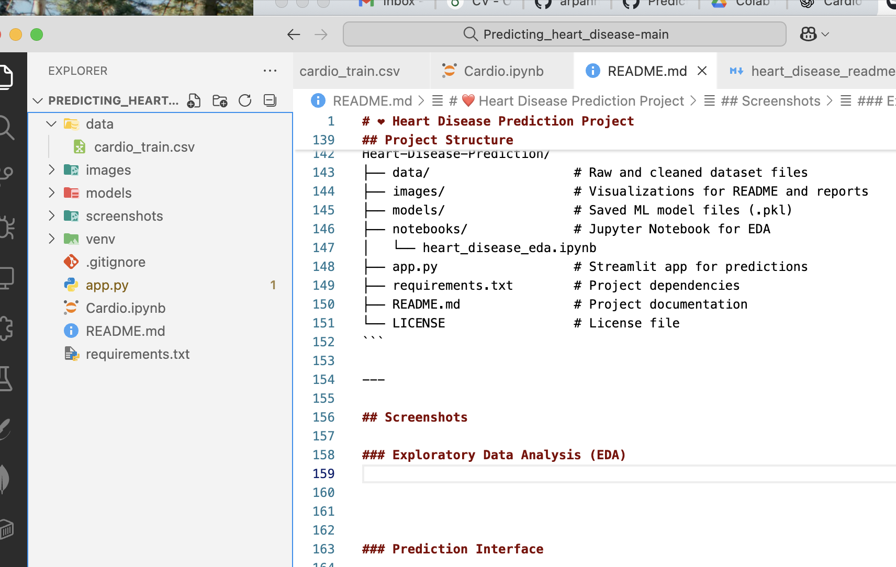
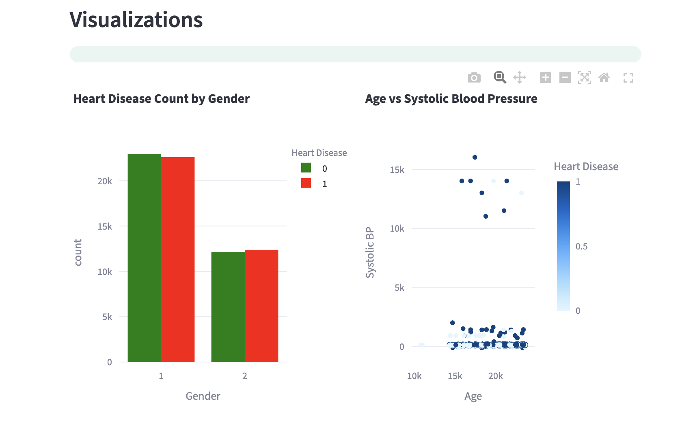
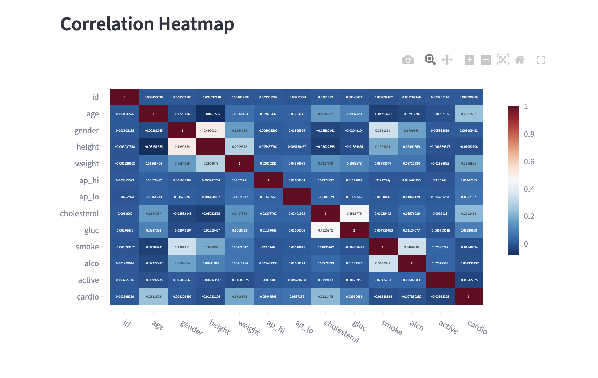
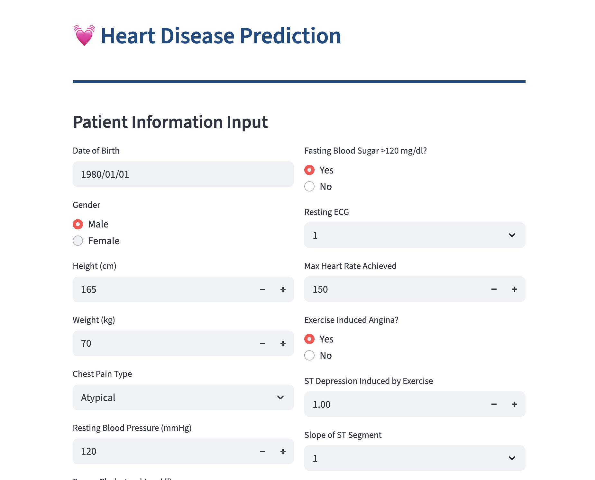
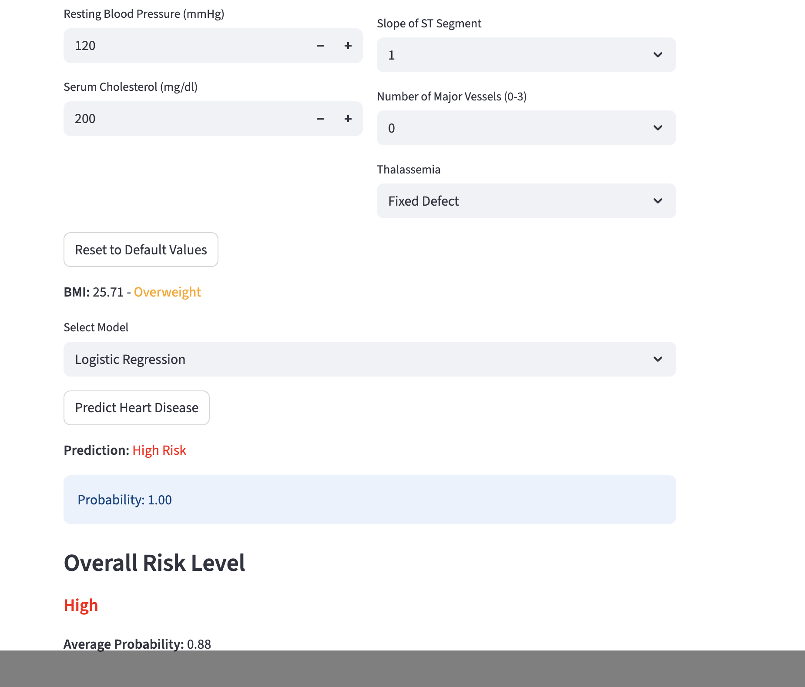
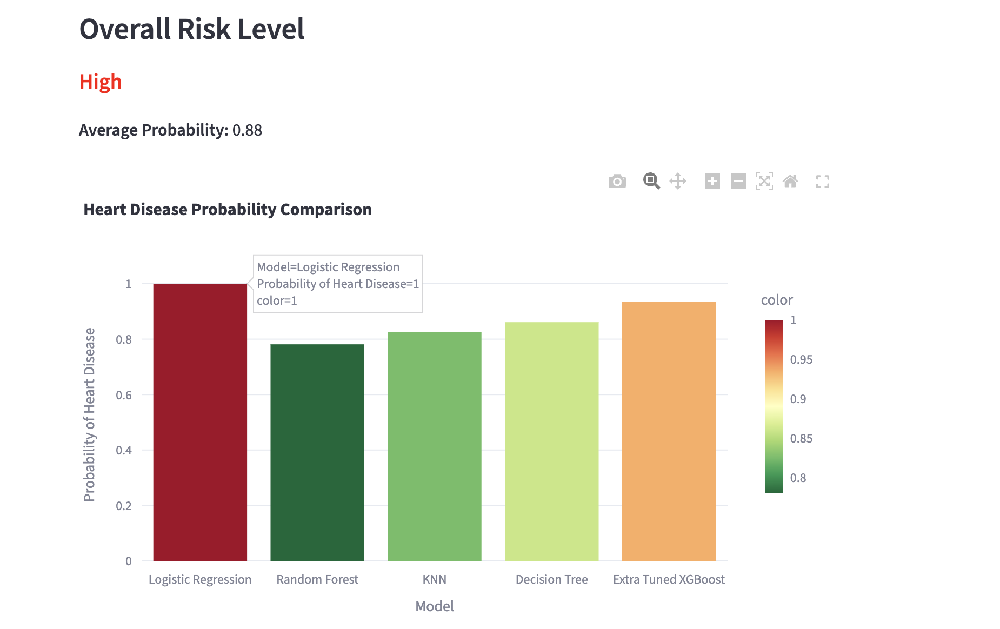

# ❤️ Heart Disease Prediction Project

Predict cardiovascular disease using patient health data. This project integrates **data analysis via Jupyter Notebook** and an **interactive Streamlit dashboard** for real-time predictions.

---

## 📋 Table of Contents

1. [About the Project](#about-the-project)
2. [Features](#features)
3. [Model Performance & Findings](#model-performance--findings)
4. [Installation](#installation)
5. [Usage](#usage)
6. [Project Structure](#project-structure)
7. [Screenshots](#screenshots)
8. [Future Enhancements](#future-enhancements)
9. [Contributing](#contributing)
10. [License](#license)
11. [Contact](#contact)

---

## About the Project

Early detection of Cardiovascular Disease (CVD) can save lives by enabling timely interventions. This project aims to:

- Analyze patient data to identify patterns associated with CVD.
- Train, evaluate, and compare multiple machine learning models.
- Provide an interactive interface for real-time predictions via Streamlit.
- Demonstrate an end-to-end ML workflow from **EDA to deployment**.

### Background on Cardiovascular Disease

CVD includes conditions affecting the heart and blood vessels, such as:

- **Atherosclerosis**: Plaque buildup in arteries
- **Heart attack (Myocardial infarction)**
- **Stroke**
- **Heart failure**
- **Arrhythmia**: Abnormal heart rhythm
- **Heart valve issues**

[Source: American Heart Association](https://www.heart.org/en/health-topics/consumer-healthcare/what-is-cardiovascular-disease)

### Dataset Description

**Source:** [Kaggle Cardiovascular Disease Dataset](https://www.kaggle.com/sulianova/cardiovascular-disease-dataset) – 70,000 records with 12 features + target.

| Feature     | Description                                   |
| ----------- | --------------------------------------------- |
| id          | Patient ID                                    |
| age         | Age in days                                   |
| height      | Height (cm)                                   |
| weight      | Weight (kg)                                   |
| gender      | Male=1, Female=0                              |
| ap\_hi      | Systolic BP                                   |
| ap\_lo      | Diastolic BP                                  |
| cholesterol | 1=Normal, 2=Above normal, 3=Well above normal |
| gluc        | 1=Normal, 2=Above normal, 3=Well above normal |
| smoke       | Smoker (1) / Non-smoker (0)                   |
| alco        | Alcohol intake (1/0)                          |
| active      | Physically active (1/0)                       |
| cardio      | Target: 1=CVD, 0=No CVD                       |

---

## Features

- Data Cleaning & Preprocessing
- Exploratory Data Analysis (BMI, BP, Age, Gender, Cholesterol, Glucose, Lifestyle)
- Multiple Machine Learning Models (Logistic Regression, Random Forest, SVM, KNN, Decision Tree, XGBoost)
- Hyperparameter Tuning (Grid Search & Randomized Search)
- Interactive Streamlit Dashboard with real-time predictions
- Reset to default values for input forms

---

## Model Performance & Findings

**Metrics Computed:** Train & Test Accuracy, F1 Score, False Negatives / True Positives, Classification Report & Confusion Matrix

| Model                  | Train Acc (%) | Test Acc (%) | F1 Score | False Negatives | True Positives |
| ---------------------- | ------------- | ------------ | -------- | --------------- | -------------- |
| RS XGBoost             | 72.02         | 71.56        | 0.74     | 1,593           | 6,869          |
| RS Decision Tree       | 72.83         | 72.84        | 0.73     | 2,314           | 6,148          |
| Tuned SVM              | 73.02         | 72.24        | 0.73     | 1,890           | 6,572          |
| RS Random Forest       | 81.84         | 72.05        | 0.73     | 1,865           | 6,597          |
| GS Logistic Regression | 71.53         | 71.32        | 0.73     | 1,766           | 6,696          |
| Extra Tuned XGBoost    | 65.01         | 64.51        | 0.72     | 665             | 7,797          |
| Logistic Regression    | 72.83         | 72.82        | 0.71     | 2,825           | 5,637          |
| Support Vector Machine | 73.78         | 73.22        | 0.71     | 2,790           | 5,672          |
| XGBoost                | 76.38         | 72.81        | 0.71     | 2,702           | 5,760          |
| GS KNN                 | 99.55         | 71.63        | 0.71     | 2,629           | 5,833          |
| Random Forest          | 99.55         | 71.25        | 0.71     | 2,547           | 5,915          |
| KNN                    | 78.40         | 69.06        | 0.69     | 2,695           | 5,767          |
| Decision Tree          | 99.55         | 63.39        | 0.63     | 3,165           | 5,297          |

**Insights:** Tuned models outperform untuned models in F1 score, False Negatives, and True Positives.

---

## Installation

```bash
# Clone repository
git clone https://github.com/username/Heart-Disease-Prediction.git
cd Heart-Disease-Prediction

# Create virtual environment
python -m venv venv
source venv/bin/activate  # Linux/Mac
venv\Scripts\activate     # Windows

# Install dependencies
pip install -r requirements.txt
```

**Dependencies:** `pandas`, `numpy`, `scikit-learn`, `xgboost`, `plotly`, `streamlit`, `matplotlib`, `seaborn`

---

## Usage

```bash
# Run Jupyter Notebook
jupyter notebook Cardio.ipynb

# Run Streamlit App
streamlit run app.py
```

- Input patient health data in the Streamlit interface.
- Choose model for prediction.
- View risk probability, BMI category, and interactive EDA plots.
- Reset form to default values if needed.

---

## Project Structure

```
Heart-Disease-Prediction/
├── data/                   # Raw and cleaned dataset files
├── images/                 # Visualizations for README and reports
├── models/                 # Saved ML model files (.pkl)
├── Cardio.ipynb             # Jupyter Notebook for EDA
│   
├── app.py                  # Streamlit app for predictions
├── requirements.txt        # Project dependencies
├── README.md               # Project documentation
└── LICENSE                 # License file
```

---

## Screenshots

### Exploratory Data Analysis (EDA)






### Prediction Interface





---


## Future Enhancements

- Explainable AI (SHAP/LIME) for feature importance
- CSV upload for batch predictions
- Real-time alerts for high-risk patients
- User authentication for secure deployment
- Expanded dataset with additional biomarkers
- Improved interactive EDA visualizations
- Multimodal model integration for combining text, image, or other data
- Fine-tuning additional models for better prediction performance
- Chatbot integration for interactive user queries

---

## Contributing

Contributions are welcome! Please fork the repository, make changes, and submit a pull request.

---

## License

MIT License – see [LICENSE](LICENSE) for details.

---

## Contact

**Arpan Neupane**\
Email: [arpanneupane75@gmail.com](mailto\:arpanneupane75@gmail.com)\
Phone: +977-9869540374

# Heart-Disease-Prediction
